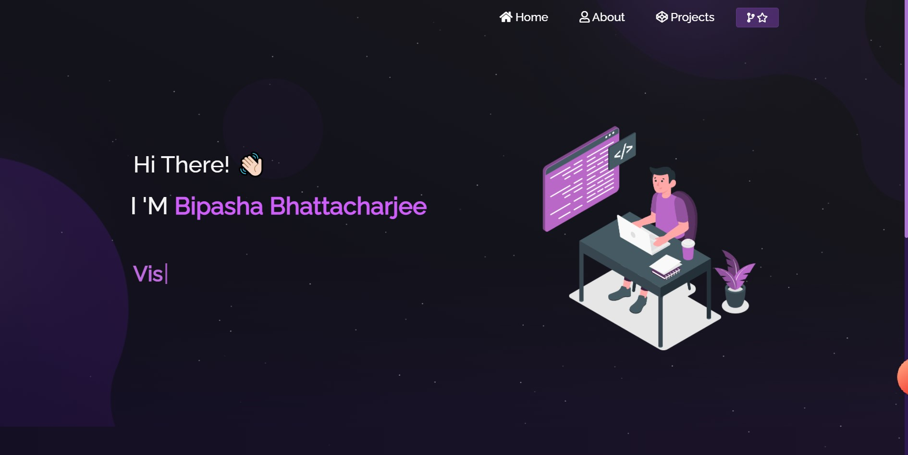

<h1 align="center">Portfolio</h1>

Portfolio of my website

## Live at:
### `https://bipashabhatt.herokuapp.com/`

## Screenshots

## Available Scripts

In the project directory, you can run:

### `yarn install`

### `yarn start` 

